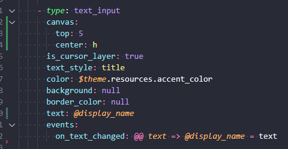

# yui-vs-code-support README

## Features

Provides syntax highlighting for .yui files (see https://github.com/shdwcat/YUI)

## Release Notes

### 0.1.1
* Syntax highlighting should now work correctly inside parens
	* YuiScript is now properly defined as a full syntax instead of just tacking things on top of JavaScript

### 0.1.0

* Adds syntax highlighting support for embedded YuiScript
* Adds special highlighting for the `type: name` of an element, to make a file's structure easier to understand
* Removes highlighting for a few more YAML features that YUI does not support (merging, aliases, explicit mapping keys, etc)

### 0.0.1

Initial release of yui-vs-code-support
